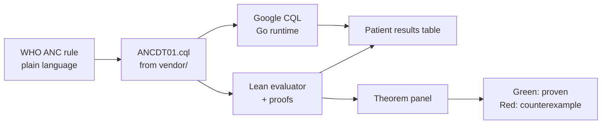

# Lean + CQL for WHO Antenatal Care Guidelines

**Repository:** [github.com/jessicalundin/lean_cql_anc](https://github.com/jessicalundin/lean_cql_anc) · **Demo Space:** [gatesfoundation/lean-cql-anc](https://huggingface.co/spaces/gatesfoundation/lean-cql-anc)

A demonstration project showing how [Lean](https://lean-lang.org/) formal verification can complement [Clinical Quality Language (CQL)](https://cql.hl7.org/) decision logic for [WHO SMART Antenatal Care (ANC)](https://www.who.int/teams/digital-health-and-innovation/smart-guidelines) guidelines.

**CQL** is the right language for ANC decision logic because HL7 defines it for clinical quality and decision-support artifacts. **Lean** is useful because it is both a functional programming language and a theorem prover. WHO ANC guidance already ships FHIR/CQL-style implementation artifacts, including ANC recommendation logic.

---

## Architecture

```
WHO ANC guidance / SMART ANC
        ↓
FHIR data model + value sets
        ↓
CQL rules for clinical decision support (ANCDT01.cql)
       ↙                    ↘
Google CQL runtime     Lean model of CQL semantics
(execution)            (hand-written, mirroring ANCDT01 logic)
                              ↓
                       Proofs: safety, consistency, no contradictory recommendations
```

| Layer | Role | Primary artifacts |
|-------|------|-------------------|
| Clinical source | WHO recommendations, workflows, danger signs | [WHO ANC DAK](https://www.who.int/publications-detail-redirect/9789240020306), [SMART ANC IG](http://build.fhir.org/ig/WorldHealthOrganization/smart-anc/) |
| Interoperability | Patient data, observations, conditions | FHIR R4 resources, SNOMED/LOINC value sets |
| Decision logic | Computable CDS rules | WHO SMART ANC CQL (`ANCDT01.cql`, `ANCCommon.cql`) sourced via `vendor/smart-anc` |
| Execution | CQL on FHIR patients | [Google CQL engine](https://github.com/google/cql) (Go; runs CQL source directly on FHIR bundles) |
| Verification | Executable semantics + proofs | Lean model of ANCDT01 logic (`PatientState`, `disposition`), theorems, `#eval` / `#check` |

### Why this pipeline

1. **WHO SMART ANC** already formalizes ANC as FHIR Implementation Guide content with CQL libraries — see the [smart-anc repository](https://github.com/WorldHealthOrganization/smart-anc/) and [ANC Common Logic example](https://www.cqframework.org/cpg-example-anc/Library-ANCCommon.html).
2. **Google CQL** runs the authoritative WHO CQL source directly on FHIR bundles with no translation step, giving a clean execution path and a second opinion on the Lean model.
3. **Lean** gives a small trusted kernel, dependent types, and proof automation (`grind`, `simp`, etc.) to state and discharge safety properties that CQL engines do not check at authoring time.

---

## What Lean should verify

These are the demonstration properties — stated as theorems over a Lean model of ANCDT01 logic on FHIR-shaped patient states.

### 1. No missed critical cases

> Every ANC danger sign implies referral.

```lean
-- Sketch: if any danger-sign predicate holds, referral is recommended
theorem danger_sign_implies_referral (p : PatientState) :
  HasDangerSign p → RecommendsReferral p
```

**Intent:** Completeness of safety-critical branching. A danger sign must never fall through to routine care.

### 2. No contradictory outputs

> The same patient cannot receive both "routine follow-up" and "urgent referral."

```lean
theorem no_contradictory_recommendations (p : PatientState) :
  ¬ (RecommendsRoutineFollowUp p ∧ RecommendsUrgentReferral p)
```

**Intent:** Mutual exclusivity of disposition classes at a single evaluation point.

### 3. Terminology safety

> Required SNOMED/LOINC/FHIR codes map to exactly one intended clinical concept.

```lean
theorem terminology_injective (c : ClinicalCode) :
  ∃! concept : ClinicalConcept, mapsTo c concept
```

**Intent:** Value-set bindings in CQL (`codesystem`, `valueset`, `code`) align with a single semantic interpretation in the Lean model — no ambiguous or duplicate mappings.

### 4. Temporal correctness

> Gestational-age rules behave correctly across ANC contact windows.

```lean
theorem ga_contact_window (p : PatientState) (contact : ANCContact) :
  GestationalAgeWeeks p = w →
  contact ∈ ValidContactsForGA w
```

**Intent:** Rules keyed to GA thresholds (e.g. 12, 20, 26, 30, 34, 36, 38, 40 weeks in `ANCCommon`) are consistent with the 8-contact schedule and boundary conditions (inclusive/exclusive comparisons).

### 5. Null handling (three-valued logic)

> Unknown data does not silently become `false`.

```lean
theorem unknown_not_false (expr : CQLBoolean) (p : PatientState) :
  eval expr p = .unknown → eval expr p ≠ .false
```

**Intent:** Missing observations, absent conditions, and null FHIR elements propagate as **unknown** in the Lean semantics, matching CQL's nullological rules — not short-circuiting to "no action needed."

---

## Prototype scope

Keep the first demo **small, end-to-end, and provable** rather than covering the full SMART ANC IG.

### In scope (v0.1)

| Component | Scope |
|-----------|--------|
| CQL source | **[`ANCDT01.cql`](https://github.com/WorldHealthOrganization/smart-anc/blob/master/input/cql/ANCDT01.cql)** from WHO SMART ANC — Quick Check danger signs → referral disposition (ANC.B5, 13 sign codes DE50–DE62, code system `http://smart.who.int/anc/CodeSystem/anc-custom-codes`) |
| FHIR fixtures | 9 `Bundle` JSON patients from [OpenAI HealthBench](https://github.com/openai/healthbench) ANC scenarios, regenerated via `scripts/extract_danger_signs.py --fhir` |
| Lean model | `PatientState` with `dangerSignStatus : Trilean`, `Recommendation` enum, disposition evaluator |
| Proofs | 2 theorems proved: danger-sign completeness (`HasDangerSign p → disposition p = .urgentReferral`), no contradictory recommendations |
| Cross-check | Same fixtures run through Google CQL (Go runtime) and Lean `#eval`; diff against expected disposition |

### Out of scope (later)

- Full SMART ANC pathway (all 8 contacts, all indicators)
- Complete CQL/ELM operator surface
- VSAC terminology service integration
- Production CDS deployment

### Suggested repository layout

```
lean_cql_anc/
├── README.md
├── vendor/smart-anc/       # WHO SMART ANC CQL source (sparse-cloned by setup-vendor.sh; gitignored)
│   └── input/cql/          # ANCDT01.cql, ANCContactDataElements.cql, ANCCommon.cql, …
├── fixtures/patients/      # FHIR R4 Bundle patients from OpenAI HealthBench (hb-*.json)
├── lean/
│   └── LeanCqlAnc/
│       ├── Basic.lean      # PatientState, Trilean, Recommendation
│       ├── DangerSigns.lean # HasDangerSign, disposition evaluator
│       ├── Proofs.lean     # Theorems
│       └── Json.lean       # Parse FHIR Bundle → PatientState
├── scripts/
│   ├── setup-vendor.sh     # Sparse-clone WHO smart-anc repo into vendor/
│   ├── extract_danger_signs.py  # Claude extraction: conversation → FHIR Bundle
│   └── cql_runner.py       # Run Google CQL on fixtures, compare to Lean
└── space/
    └── app.py              # Gradio demo (Hugging Face Space)
```

---

## CQL toolchain: what to use where

The demo uses **different tools for different jobs**. They are complementary, not interchangeable.

| Tool | Role | Use in this demo? | Why |
|------|------|-------------------|-----|
| **[Google CQL](https://github.com/google/cql)** | **Runtime**: CQL source on FHIR (Go) | **Yes — primary live engine** | Runs `ANCDT01.cql` directly on FHIR bundles; no Java/ELM step needed for execution |
| **[CQFramework cql-to-elm](https://github.com/cqframework/clinical_quality_language)** | **Compiler**: CQL → ELM JSON/XML | Optional | Normative HL7 translator if you want to import ELM into Lean rather than re-implement the evaluator |
| **[cql-translation-service](https://github.com/cqframework/cql-translation-service)** | REST wrapper around cql-to-elm | Optional | Useful for a live “paste CQL → see ELM” UX |
| **[cql-execution](https://github.com/cqframework/cql-execution)** + **[cql-exec-fhir](https://github.com/cqframework/cql-exec-fhir)** | **Runtime**: ELM on FHIR patients (JavaScript) | Optional | Alternative cross-check engine; requires ELM translation step first |
| **CQFramework Java engine** (`clinical_quality_language` engine module) | ELM runtime (JVM) | Optional | Heavier on Hugging Face; use if you already run Java for translation |

### Google CQL: worth including?

**Yes, as a second execution engine — not as the compile step.**

[Google CQL](https://github.com/google/cql) is an experimental Go execution engine ([announcement](https://opensource.googleblog.com/2024/07/google-cql-from-clinical-measurements-to-action.html)). It runs **CQL source directly** on FHIR R4 bundles and ships a CLI, REPL, and web playground. That makes it excellent for a live “paste CQL + pick patient → see result” UX.

Important constraints for *this* project:

- **No ELM export** — Google CQL runs CQL source directly; if you want the ELM-import Lean path, you still need CQFramework’s CQL-to-ELM output.
- **Experimental coverage** — no uncertainties, limited operators, Patient context only. `ANCDT01` Quick Check fits within this scope.
- **Disagreements are a feature** — when Google CQL and Lean diverge, the demo shows *why* formal semantics matter (exactly the Lean value prop).

Recommended triangle for stakeholder demos:

```
              WHO ANCDT01.cql source
                     │
         ┌───────────┴───────────┐
         ▼                       ▼
    Google CQL               Lean evaluator
    (Go runtime)              + proofs (offline)
    live in Space             proved in CI

         └───────────┬───────────┘
                     ▼
              Results must agree
```

Both execution paths evaluate the same FHIR fixtures; Lean proves safety properties the runtime cannot check.

---

## Demonstration UX

A live demo should make the **two execution paths** visible side by side and show **proofs as first-class artifacts**.

### Recommended demo flow (15–20 minutes)



1. **Clinical anchor** — Show the WHO ANC.B5 Quick Check danger-sign rule in prose (from DAK Web Annex B), then the matching CQL `define` in `ANCDT01.cql`.
2. **Observe model** — Each danger sign is a single FHIR `Observation` with `code=ANC.B5.DE48` ("Danger signs") and `valueCodeableConcept` = the specific sign code (DE50–DE62), or DE49 ("No danger signs") when clear.
3. **Evaluate patients** — Pick a fixture patient; run Google CQL and Lean `#eval`; results appear in a shared table (referral yes/no/unknown).
4. **Prove** — In the Lean file, `#check` the theorem statement, then step through or `grind` the proof; show that a deliberately broken rule fails to compile or produces a counterexample `PatientState`.
5. **Null handling** — `hb-fetal-movement-reduced.json` and `hb-high-bp-30wks.json` have no ANCDT01 danger signs; both engines return **no danger signs** (DE49), demonstrating clean negative evaluation.

### UX surfaces

| Surface | Audience | What they see |
|---------|----------|---------------|
| **VS Code / Cursor** | Engineers | Lean Infoview, `uv sync`, tasks for `lake build` + local Gradio |
| **Static report** | Clinical informatics | HTML/Markdown table: rule × patient × CQL result × Lean result × proven? |
| **CLI** | CI / reproducibility | `lake build` + `scripts/cql_runner.py` → exit 1 on mismatch |
| **Hugging Face Space** | Public stakeholder demo | Gradio UI: patient picker, live Google CQL engine, cached Lean proof status |

### Minimal CLI experience

```bash
# 1. Fetch WHO SMART ANC CQL source (sparse clone into vendor/)
./scripts/setup-vendor.sh

# 2. Build Lean proofs
cd lean && lake build && cd ..

# 3. Extract danger signs from a HealthBench fixture (requires ANTHROPIC_API_KEY)
python scripts/extract_danger_signs.py fixtures/patients/hb-severe-headache.json --fhir

# 4. Cross-check Google CQL runtime vs formal Lean model
python scripts/cql_runner.py fixtures/patients/hb-vaginal-bleeding.json

# Expected output:
#   Google CQL:  Should Proceed with ANC contact OR Referral → REFERRAL
#   Lean #eval:  REFERRAL
#   theorem danger_sign_implies_referral: ✓ proved
```

---

## Hugging Face Spaces deployment

A Space is a strong fit for this demo: clinical informatics audiences get a **clickable** pipeline without installing Lean, Java, or Go locally. Lean proofs run **offline in CI**; the Space shows pre-built results.

**Compute:** Start on **CPU Basic** (free). CQL execution and Lean artifacts are CPU-only — **GPU is not needed** for v0.1. Use **CPU Upgrade** for faster cold starts during live demos; reserve GPU only if you later add an on-Space LLM (e.g. WHO guidance chat). See [docs/huggingface-setup.md](docs/huggingface-setup.md#compute-cpu-vs-gpu).

### Recommended Space architecture

```
┌─────────────────────────────────────────────────────────────┐
│  Gradio app (Python)                                        │
│  ┌─────────────┐  ┌──────────────┐  ┌───────────────────┐ │
│  │ ANCDT01.cql │  │ Patient      │  │ Results table     │ │
│  │ (read-only, │  │ fixture      │  │ Google   │ Lean   │ │
│  │ from vendor)│  │ dropdown     │  │ CQL      │ match? │ │
│  └──────┬──────┘  └──────┬───────┘  └───────────────────┘ │
│         │                │                                  │
│         ▼                ▼                                  │
│  ┌──────────────────────────────┐  ┌───────────────────┐  │
│  │ google/cql CLI (Go binary)   │  │ proof_status.json │  │
│  │ cql_runner.py subprocess     │  │ (from CI / lake)  │  │
│  └──────────────────────────────┘  └───────────────────┘  │
└─────────────────────────────────────────────────────────────┘
```

### What runs live vs precomputed

| Step | Where | Rationale |
|------|-------|-----------|
| WHO CQL source (`vendor/`) | **Bundled via `setup-vendor.sh`** | Sparse-clone at build time; CQL is read-only |
| Google CQL on fixtures | **Live in Space** | Go binary; CQL source + FHIR bundle → disposition in one call |
| Lean `lake build` + proofs | **CI only** → commit `artifacts/proof_status.json` + `artifacts/lean_eval.json` | elan + Mathlib-style deps are too heavy for interactive cold start |
| ANCDT01.cql viewer | **Static** (syntax-highlighted from `vendor/`) | Shows the real WHO rule, not a custom rewrite |

### Suggested `app.py` flow

1. User selects an ANC scenario (e.g. “vaginal bleeding — danger sign”, “GA 20 weeks — boundary”, “missing signs — unknown”).
2. App loads the FHIR `Bundle` fixture and WHO `ANCDT01.cql` from `vendor/smart-anc`.
3. Backend runs **Google CQL** (`scripts/cql_runner.py`) to evaluate `Should Proceed with ANC contact OR Referral` and `Should Proceed with ANC contact`.
4. UI merges in **precomputed Lean** results and theorem badges (green = proved in last CI run).
5. Mismatch row highlights in red with a link to the theorem that should catch it.

### Space deploy

Python deps are managed with **[uv](https://docs.astral.sh/uv/)** (`pyproject.toml` + `uv.lock`). The Space `Dockerfile` runs `uv sync --frozen` and `uv run python app.py`. Stage with:

```bash
./scripts/prepare-space.sh /path/to/hf-space-clone
```

See [docs/huggingface-setup.md](docs/huggingface-setup.md) and [docs/coding-environment.md](docs/coding-environment.md).

### UX touches that land well on HF

- **WHO ANC quote** at top (plain-language danger sign) → expand to real `ANCDT01.cql` source from `vendor/`
- **Two-column results**: Google CQL (live) | Lean (verified, precomputed)
- **Theorem panel**: “Danger sign → referral: proved ✓” with commit SHA of last successful `lake build`
- **Negative case**: `hb-fetal-movement-reduced.json` — no ANCDT01 danger signs → DE49 "No danger signs" → routine follow-up
- **Scope badge**: “Prototype: ANCDT01 Quick Check, 15 patients, 2 theorems proved” — sets expectations

### What not to put in the Space

- Full SMART ANC IG translation at request time (timeout risk)
- Interactive Lean proof stepping (use a linked GitHub Actions log or local dev setup instead)
- VSAC live terminology (bundle value sets as static FHIR `ValueSet` JSON in repo)

---

## Getting started

### Prerequisites

- [uv](https://docs.astral.sh/uv/) (Python env + Gradio Space)
- [Lean 4](https://lean-lang.org/) (via `elan`)
- Go 1.21+ (for [Google CQL](https://github.com/google/cql) — primary execution engine)
- Node.js 18+ (optional, for Hugging Face Space JS tooling)
- Java 11+ (optional, for [CQL-to-ELM translation](https://github.com/cqframework/clinical_quality_language) if pursuing the ELM-import Lean path)

### Install Python (uv)

```bash
curl -LsSf https://astral.sh/uv/install.sh | sh
uv sync
uv run python space/app.py   # local demo at http://127.0.0.1:7860
```

### Install Lean

```bash
curl https://raw.githubusercontent.com/leanprover/elan/master/elan-init.sh -sSf | sh
elan default stable
```

### Fetch WHO SMART ANC CQL source

```bash
./scripts/setup-vendor.sh
```

This sparse-clones the WHO `smart-anc` repository into `vendor/smart-anc/input/cql/` (depth 1, no blobs beyond `input/cql`). The `vendor/` directory is gitignored. Run this once before building Lean or running fixtures.

Key CQL files used:
- `vendor/smart-anc/input/cql/ANCDT01.cql` — Quick Check danger signs → referral disposition
- `vendor/smart-anc/input/cql/ANCContactDataElements.cql` — observation retrieval with `parameter encounter String`
- `vendor/smart-anc/input/cql/ANCCommon.cql` — shared helpers

### Initialize this project (when Lean sources are added)

```bash
cd lean
lake init lean_cql_anc
lake build
```

---

## Key references

| Resource | URL |
|----------|-----|
| Lean | https://lean-lang.org/ |
| HL7 CQL specification | https://cql.hl7.org/ |
| ELM logical specification | https://cql.hl7.org/04-logicalspecification.html |
| WHO SMART Guidelines | https://www.who.int/teams/digital-health-and-innovation/smart-guidelines |
| WHO ANC Digital Adaptation Kit | https://www.who.int/publications-detail-redirect/9789240020306 |
| SMART ANC FHIR IG | http://build.fhir.org/ig/WorldHealthOrganization/smart-anc/ |
| SMART ANC source | https://github.com/WorldHealthOrganization/smart-anc |
| ANC Common Logic (CQL example) | https://www.cqframework.org/cpg-example-anc/Library-ANCCommon.html |
| CQL execution (JavaScript) | https://github.com/cqframework/cql-execution |
| CQL-to-ELM translation service | https://github.com/cqframework/cql-translation-service |
| Google CQL engine (Go) | https://github.com/google/cql |
| Google CQL blog post | https://opensource.googleblog.com/2024/07/google-cql-from-clinical-measurements-to-action.html |

---

## Success criteria for the demo

- [x] Real WHO `ANCDT01.cql` used directly (sourced via `vendor/smart-anc`, not rewritten)
- [x] Fixtures use the WHO ANCDT01 observation model (`ANC.B5.DE48` / DE49–DE62, `http://smart.who.int/anc/CodeSystem/anc-custom-codes`)
- [x] **Safety** theorem proved: `HasDangerSign p → disposition p = .urgentReferral`
- [x] **Consistency** theorem proved: no patient simultaneously receives routine and urgent recommendations
- [ ] Google CQL evaluator agrees with Lean on all 15 fixture patients (cross-check automated in CI)
- [ ] Documented counterexample when a rule is intentionally weakened (proof fails)

---

## License and attribution

Clinical content derives from WHO SMART ANC guidelines. CQL semantics follow HL7 normative specifications. Lean code in this repository should carry an explicit license (e.g. Apache-2.0) compatible with upstream artifacts.
