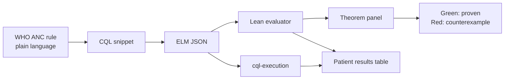

# Lean + CQL for WHO Antenatal Care Guidelines

**Repository:** [github.com/jessicalundin/lean_cql_anc](https://github.com/jessicalundin/lean_cql_anc) · **Demo Space:** [gatesfoundation/lean-cql-anc](https://huggingface.co/spaces/gatesfoundation/lean-cql-anc)

A demonstration project showing how [Lean](https://lean-lang.org/) formal verification can complement [Clinical Quality Language (CQL)](https://cql.hl7.org/) decision logic for [WHO SMART Antenatal Care (ANC)](https://www.who.int/teams/digital-health-and-innovation/smart-guidelines) guidelines.

**CQL** is the right language for ANC decision logic because HL7 defines it for clinical quality and decision-support artifacts. **Lean** is useful because it is both a functional programming language and a theorem prover. WHO ANC guidance already ships FHIR/CQL-style implementation artifacts, including ANC recommendation logic.

---

## Architecture

```
WHO ANC guidance / SMART ANC
        ↓
FHIR data model + value sets
        ↓
CQL rules for clinical decision support
        ↓
ELM (JSON/XML)
        ↓
Lean model of CQL semantics
        ↓
Proofs: safety, consistency, completeness, no contradictory recommendations
```

| Layer | Role | Primary artifacts |
|-------|------|-------------------|
| Clinical source | WHO recommendations, workflows, danger signs | [WHO ANC DAK](https://www.who.int/publications-detail-redirect/9789240020306), [SMART ANC IG](http://build.fhir.org/ig/WorldHealthOrganization/smart-anc/) |
| Interoperability | Patient data, observations, conditions | FHIR R4 resources, SNOMED/LOINC value sets |
| Decision logic | Computable CDS rules | CQL libraries (e.g. `ANCCommon`, danger-sign modules) |
| Canonical IR | Platform-independent logic tree | [ELM](https://cql.hl7.org/04-logicalspecification.html) JSON/XML from [CQL-to-ELM translator](https://cql.hl7.org/06-translationsemantics.html) |
| Verification | Executable semantics + proofs | Lean definitions, theorems, `#eval` / `#check` |
| Compile | CQL → ELM (canonical IR) | [CQFramework cql-to-elm](https://github.com/cqframework/clinical_quality_language) or [translation service](https://github.com/cqframework/cql-translation-service) |
| Runtime (demo) | Patient-facing CDS execution | [cql-execution](https://github.com/cqframework/cql-execution) + [cql-exec-fhir](https://github.com/cqframework/cql-exec-fhir) |
| Runtime (optional) | Second opinion at scale | [Google CQL engine](https://github.com/google/cql) (Go; executes CQL directly on FHIR) |

### Why this pipeline

1. **WHO SMART ANC** already formalizes ANC as FHIR Implementation Guide content with CQL libraries — see the [smart-anc repository](https://github.com/WorldHealthOrganization/smart-anc/) and [ANC Common Logic example](https://www.cqframework.org/cpg-example-anc/Library-ANCCommon.html).
2. **CQL → ELM** is a normative, bi-directional mapping defined by HL7. ELM is an abstract syntax tree: ideal for importing into Lean without parsing CQL surface syntax.
3. **Lean** gives a small trusted kernel, dependent types, and proof automation (`grind`, `simp`, etc.) to state and discharge properties that CQL engines do not check at authoring time.

---

## What Lean should verify

These are the demonstration properties — stated as theorems over a Lean encoding of ELM evaluation on FHIR-shaped patient states.

### 1. No missed critical cases

> Every ANC danger sign implies referral.

```lean
-- Sketch: if any danger-sign predicate holds, referral is recommended
theorem danger_sign_implies_referral (p : PatientState) :
  HasDangerSign p → RecommendsReferral p
```

**Intent:** Completeness of safety-critical branching. A danger sign must never fall through to routine care.

### 2. No contradictory outputs

> The same patient cannot receive both "routine follow-up" and "urgent referral."

```lean
theorem no_contradictory_recommendations (p : PatientState) :
  ¬ (RecommendsRoutineFollowUp p ∧ RecommendsUrgentReferral p)
```

**Intent:** Mutual exclusivity of disposition classes at a single evaluation point.

### 3. Terminology safety

> Required SNOMED/LOINC/FHIR codes map to exactly one intended clinical concept.

```lean
theorem terminology_injective (c : ClinicalCode) :
  ∃! concept : ClinicalConcept, mapsTo c concept
```

**Intent:** Value-set bindings in CQL (`codesystem`, `valueset`, `code`) align with a single semantic interpretation in the Lean model — no ambiguous or duplicate mappings.

### 4. Temporal correctness

> Gestational-age rules behave correctly across ANC contact windows.

```lean
theorem ga_contact_window (p : PatientState) (contact : ANCContact) :
  GestationalAgeWeeks p = w →
  contact ∈ ValidContactsForGA w
```

**Intent:** Rules keyed to GA thresholds (e.g. 12, 20, 26, 30, 34, 36, 38, 40 weeks in `ANCCommon`) are consistent with the 8-contact schedule and boundary conditions (inclusive/exclusive comparisons).

### 5. Null handling (three-valued logic)

> Unknown data does not silently become `false`.

```lean
theorem unknown_not_false (expr : CQLBoolean) (p : PatientState) :
  eval expr p = .unknown → eval expr p ≠ .false
```

**Intent:** Missing observations, absent conditions, and null FHIR elements propagate as **unknown** in the Lean semantics, matching CQL's nullological rules — not short-circuiting to "no action needed."

---

## Prototype scope

Keep the first demo **small, end-to-end, and provable** rather than covering the full SMART ANC IG.

### In scope (v0.1)

| Component | Scope |
|-----------|--------|
| CQL source | One library slice: **danger signs → referral disposition** plus **gestational age helpers** from WHO ANC common logic |
| FHIR fixtures | 5–8 synthetic `Bundle` JSON patients (danger sign present/absent, missing GA, boundary GA weeks, conflicting signals) |
| ELM import | Parse ELM JSON for a **subset** of operators: `And`, `Or`, `Not`, `Equal`, `Greater`, `Less`, `InValueSet`, `Retrieve`, `First`, `Exists` |
| Lean model | `PatientState`, `EvalResult` (true / false / unknown), `Recommendation` enum, evaluator for imported ELM |
| Proofs | 3–5 theorems: danger-sign completeness, no contradiction, one GA boundary lemma, one null-handling lemma |
| Cross-check | Same fixtures run through `cql-execution` + `cql-exec-fhir`; diff against Lean `#eval` |

### Out of scope (later)

- Full SMART ANC pathway (all 8 contacts, all indicators)
- Complete CQL/ELM operator surface
- VSAC terminology service integration
- Production CDS deployment

### Suggested repository layout

```
lean_cql_anc/
├── README.md
├── cql/                    # CQL libraries (or git submodule → smart-anc)
├── elm/                    # Translated ELM JSON
├── fhir/fixtures/          # Synthetic patient bundles
├── lean/
│   ├── LeanCqlAnc.lean     # Root module
│   ├── Elm/                # ELM AST + importer
│   ├── Semantics/          # Evaluator, null logic
│   ├── Anc/                # ANC-specific predicates
│   └── Proofs/             # Theorems
├── scripts/
│   ├── translate_cql.sh    # CQL → ELM via Java translator
│   └── crosscheck.ts       # Lean eval vs cql-execution
└── docs/
    └── demo-walkthrough.md
```

---

## CQL toolchain: what to use where

The demo uses **different tools for different jobs**. They are complementary, not interchangeable.

| Tool | Role | Use in this demo? | Why |
|------|------|-------------------|-----|
| **[CQFramework cql-to-elm](https://github.com/cqframework/clinical_quality_language)** | **Compiler**: CQL → ELM JSON/XML | **Yes — required** | Normative HL7 reference translator; ELM is the bridge into Lean |
| **[cql-translation-service](https://github.com/cqframework/cql-translation-service)** | REST wrapper around cql-to-elm | **Yes — optional** | Nice for a Space UI: `POST /cql/translator` returns ELM on paste |
| **[cql-execution](https://github.com/cqframework/cql-execution)** + **[cql-exec-fhir](https://github.com/cqframework/cql-exec-fhir)** | **Runtime**: ELM on FHIR patients | **Yes — primary live engine** | JavaScript, browser/Node-friendly, ELM-native — matches the Lean import path |
| **[Google CQL](https://github.com/google/cql)** | **Runtime**: CQL on FHIR (Go) | **Yes — optional second engine** | Great demo story (“three paths agree”), but **not a compiler** and **no ELM import/export** |
| **CQFramework Java engine** (`clinical_quality_language` engine module) | ELM runtime (JVM) | Optional | Heavier on Hugging Face; use if you already run Java for translation |

### Google CQL: worth including?

**Yes, as a second execution engine — not as the compile step.**

[Google CQL](https://github.com/google/cql) is an experimental Go execution engine ([announcement](https://opensource.googleblog.com/2024/07/google-cql-from-clinical-measurements-to-action.html)). It runs **CQL source directly** on FHIR R4 bundles and ships a CLI, REPL, and web playground. That makes it excellent for a live “paste CQL + pick patient → see result” UX.

Important constraints for *this* project:

- **No ELM export** — Google CQL cannot feed the Lean pipeline. Lean still needs CQFramework’s CQL-to-ELM output.
- **Experimental coverage** — no uncertainties, limited operators, Patient context only. Scope demo CQL to a small WHO ANC slice that runs on all three engines.
- **Disagreements are a feature** — when Google CQL and cql-execution diverge, the demo can show *why* formal semantics matter (exactly the Lean value prop).

Recommended triangle for stakeholder demos:

```
                    CQL source (WHO ANC slice)
                           │
           ┌───────────────┼───────────────┐
           ▼               ▼               ▼
    cql-to-elm         Google CQL      (author view)
           │           (Go runtime)
           ▼
        ELM JSON
           │
     ┌─────┴─────┐
     ▼           ▼
cql-execution   Lean evaluator
  (Node)         + proofs (offline)
```

All three runtimes should agree on fixture patients. Lean proves properties the engines do not check.

---

## Demonstration UX

A live demo should make the **two execution paths** visible side by side and show **proofs as first-class artifacts**.

### Recommended demo flow (15–20 minutes)



1. **Clinical anchor** — Show one WHO danger-sign recommendation in prose (from DAK Web Annex B), then the matching CQL `define`.
2. **Translate** — Run CQL-to-ELM; open ELM JSON and highlight the `Exists` / `InValueSet` nodes.
3. **Evaluate patients** — Pick a fixture patient; run JavaScript CDS and Lean `#eval`; results appear in a shared table (referral yes/no/unknown).
4. **Prove** — In the Lean file, `#check` the theorem statement, then step through or `grind` the proof; show that a deliberately broken rule fails to compile or produces a counterexample `PatientState`.
5. **Null case** — Toggle off a required observation in the fixture; show JS and Lean both return **unknown**, not false.

### UX surfaces

| Surface | Audience | What they see |
|---------|----------|---------------|
| **VS Code / Cursor** | Engineers | Lean Infoview, `uv sync`, tasks for `lake build` + local Gradio |
| **Static report** | Clinical informatics | HTML/Markdown table: rule × patient × CQL result × Lean result × proven? |
| **CLI** | CI / reproducibility | `lake build` + `scripts/crosscheck.ts` → exit 1 on mismatch |
| **Hugging Face Space** | Public stakeholder demo | Gradio UI: patient picker, live CQL/ELM engines, cached Lean proof status |

### Minimal CLI experience

```bash
# 1. Translate CQL → ELM
./scripts/translate_cql.sh cql/DangerSigns.cql elm/DangerSigns.json

# 2. Build Lean proofs
cd lean && lake build

# 3. Cross-check runtime vs formal model
npm run crosscheck -- --fixture fhir/fixtures/danger-sign-bleeding.json

# Expected output:
#   cql-execution:  REFERRAL
#   Lean #eval:     REFERRAL
#   theorem danger_sign_implies_referral: ✓ proved
```

---

## Hugging Face Spaces deployment

A Space is a strong fit for this demo: clinical informatics audiences get a **clickable** pipeline without installing Lean, Java, or Go locally. Lean proofs run **offline in CI**; the Space shows pre-built results.

**Compute:** Start on **CPU Basic** (free). CQL execution and Lean artifacts are CPU-only — **GPU is not needed** for v0.1. Use **CPU Upgrade** for faster cold starts during live demos; reserve GPU only if you later add an on-Space LLM (e.g. WHO guidance chat). See [docs/huggingface-setup.md](docs/huggingface-setup.md#compute-cpu-vs-gpu).

### Recommended Space architecture

```
┌─────────────────────────────────────────────────────────────┐
│  Gradio app (Python)                                        │
│  ┌─────────────┐  ┌──────────────┐  ┌───────────────────┐ │
│  │ CQL editor  │  │ Patient      │  │ Results table     │ │
│  │ (read-only  │  │ fixture      │  │ cql-exec │ Google │ │
│  │  or slice)  │  │ dropdown     │  │ Lean     │ match? │ │
│  └──────┬──────┘  └──────┬───────┘  └───────────────────┘ │
│         │                │                                  │
│         ▼                ▼                                  │
│  ┌──────────────┐  ┌──────────────┐  ┌───────────────────┐ │
│  │ Node child   │  │ google/cql   │  │ proof_status.json │ │
│  │ process:     │  │ CLI binary   │  │ (from CI / lake)  │ │
│  │ cql-execution│  │ (optional)   │  │                   │ │
│  └──────────────┘  └──────────────┘  └───────────────────┘ │
└─────────────────────────────────────────────────────────────┘
```

### What runs live vs precomputed

| Step | Where | Rationale |
|------|-------|-----------|
| CQL → ELM | **Precomputed in repo** (or translation-service on paste) | Java/JVM cold start is slow on free-tier Spaces |
| cql-execution on fixtures | **Live in Space** | Fast Node; good interactivity |
| Google CQL on fixtures | **Live if binary fits** | Compelling “second engine”; pin a release tag |
| Lean `lake build` + proofs | **CI only** → commit `artifacts/proof_status.json` + `artifacts/lean_eval.json` | elan + Mathlib-style deps are too heavy for interactive cold start |
| ELM tree viewer | **Static** (syntax-highlighted JSON) | Educational; no server needed |

### Suggested `app.py` flow

1. User selects an ANC scenario (e.g. “vaginal bleeding — danger sign”, “GA 20 weeks — boundary”, “missing GA — null”).
2. App loads the FHIR `Bundle` fixture and the pinned CQL library slice.
3. Backend runs **cql-execution** (subprocess `node scripts/eval.js`) and optionally **Google CQL** (`cql eval ...`).
4. UI merges in **precomputed Lean** results and theorem badges (green = proved in last CI run).
5. Mismatch row highlights in red with a link to the theorem that should catch it.

### Space deploy

Python deps are managed with **[uv](https://docs.astral.sh/uv/)** (`pyproject.toml` + `uv.lock`). The Space `Dockerfile` runs `uv sync --frozen` and `uv run python app.py`. Stage with:

```bash
./scripts/prepare-space.sh /path/to/hf-space-clone
```

See [docs/huggingface-setup.md](docs/huggingface-setup.md) and [docs/coding-environment.md](docs/coding-environment.md).

### UX touches that land well on HF

- **WHO ANC quote** at top (plain-language danger sign) → expand to CQL → expand to ELM
- **Three-column results**: CQFramework path (ELM → JS) | Google CQL | Lean (verified)
- **Theorem panel**: “Danger sign → referral: proved ✓” with commit SHA of last successful `lake build`
- **Null toggle**: checkbox “remove GA observation” — watch all engines flip to unknown/null
- **Scope badge**: “Prototype: 1 library, 6 patients, 8 ELM operators” — sets expectations

### What not to put in the Space

- Full SMART ANC IG translation at request time (timeout risk)
- Interactive Lean proof stepping (use a linked GitHub Actions log or local dev setup instead)
- VSAC live terminology (bundle value sets as static FHIR `ValueSet` JSON in repo)

---

## Getting started

### Prerequisites

- [uv](https://docs.astral.sh/uv/) (Python env + Gradio Space)
- [Lean 4](https://lean-lang.org/) (via `elan`)
- Java 11+ (for [CQL-to-ELM](https://github.com/cqframework/clinical_quality_language))
- Node.js 18+ (for CQL prototype eval and Hugging Face Space)
- Go 1.21+ (optional, for [Google CQL](https://github.com/google/cql) second-engine cross-check)

### Install Python (uv)

```bash
curl -LsSf https://astral.sh/uv/install.sh | sh
uv sync
uv run python space/app.py   # local demo at http://127.0.0.1:7860
```

### Install Lean

```bash
curl https://raw.githubusercontent.com/leanprover/elan/master/elan-init.sh -sSf | sh
elan default stable
```

### Clone WHO ANC artifacts (reference)

```bash
git clone https://github.com/WorldHealthOrganization/smart-anc.git vendor/smart-anc
```

CQL libraries live under the IG source tree; translate with the CQFramework translator to produce ELM for import.

### Initialize this project (when Lean sources are added)

```bash
cd lean
lake init lean_cql_anc
lake build
```

---

## Key references

| Resource | URL |
|----------|-----|
| Lean | https://lean-lang.org/ |
| HL7 CQL specification | https://cql.hl7.org/ |
| ELM logical specification | https://cql.hl7.org/04-logicalspecification.html |
| WHO SMART Guidelines | https://www.who.int/teams/digital-health-and-innovation/smart-guidelines |
| WHO ANC Digital Adaptation Kit | https://www.who.int/publications-detail-redirect/9789240020306 |
| SMART ANC FHIR IG | http://build.fhir.org/ig/WorldHealthOrganization/smart-anc/ |
| SMART ANC source | https://github.com/WorldHealthOrganization/smart-anc |
| ANC Common Logic (CQL example) | https://www.cqframework.org/cpg-example-anc/Library-ANCCommon.html |
| CQL execution (JavaScript) | https://github.com/cqframework/cql-execution |
| CQL-to-ELM translation service | https://github.com/cqframework/cql-translation-service |
| Google CQL engine (Go) | https://github.com/google/cql |
| Google CQL blog post | https://opensource.googleblog.com/2024/07/google-cql-from-clinical-measurements-to-action.html |

---

## Success criteria for the demo

- [ ] One real WHO ANC CQL rule translated to ELM and imported into Lean
- [ ] Evaluator agrees with `cql-execution` on all fixture patients
- [ ] At least one **safety** theorem proved (danger sign → referral)
- [ ] At least one **consistency** theorem proved (no contradictory dispositions)
- [ ] Documented counterexample when a rule is intentionally weakened (proof fails)

---

## License and attribution

Clinical content derives from WHO SMART ANC guidelines. CQL/ELM semantics follow HL7 normative specifications. Lean code in this repository should carry an explicit license (e.g. Apache-2.0) compatible with upstream artifacts.
